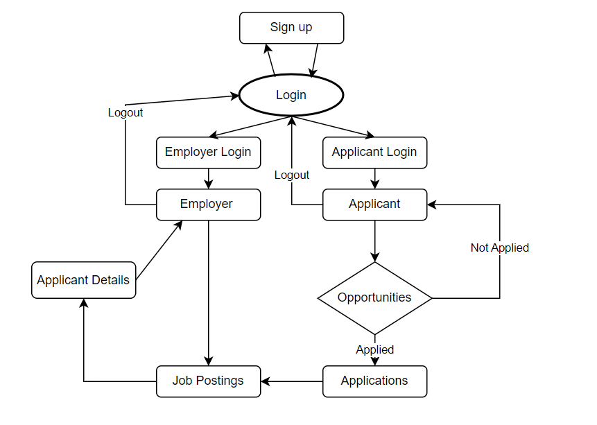
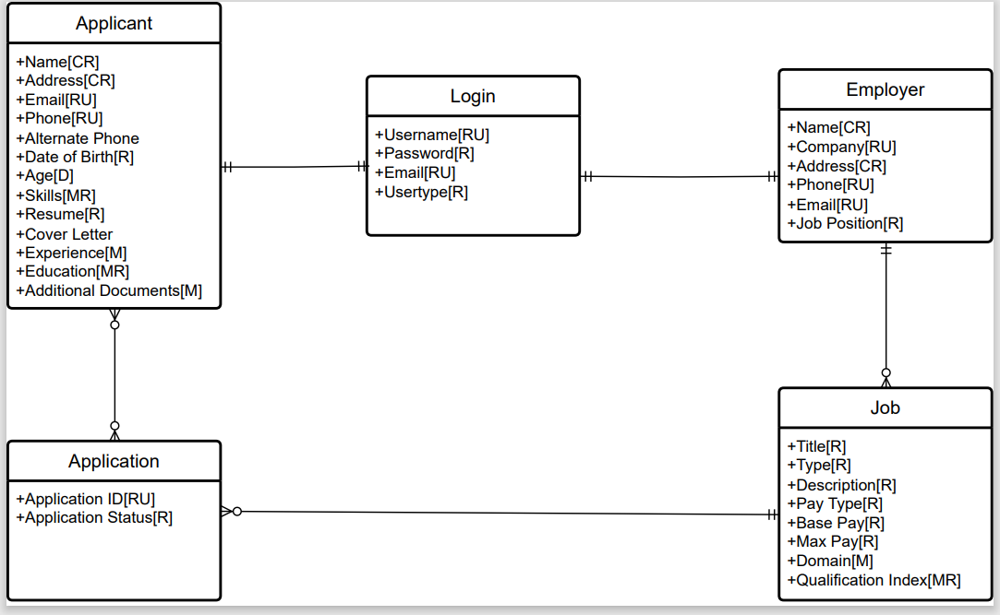
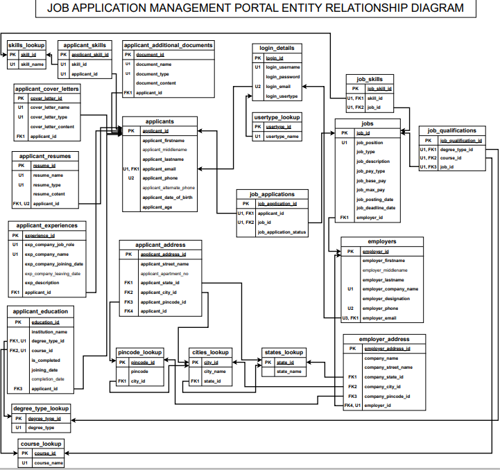

## Job Portal Management using SQL

### Introduction:

I created a job portal management system using SQL. The database was designed and created by me. A step-by-step process was followed right from gathering requirements, conceptual diagram, logical diagram(ER), and navigation diagram. Power app was used for the front end. It is a portal for both applicants and employers. Employers can post job postings and applicants can apply for the same. The employer can view all the applications, the applicant can view the job applications he/she applied. Employers can accept or reject the application. Also, there are different logins for employers and applicants, including sign-up pages. The focus was on a user-friendly portal.

I have also uploaded all the files in the repository including SQL scripts, please feel free to use them.

 
 

### Below are the navigation, conceptual and logical diagrams:
 

  

 
 
### Conceptual Diagram:
 

  
 
 
### Logical(ER) Diagram:
 

  
 
 

    
